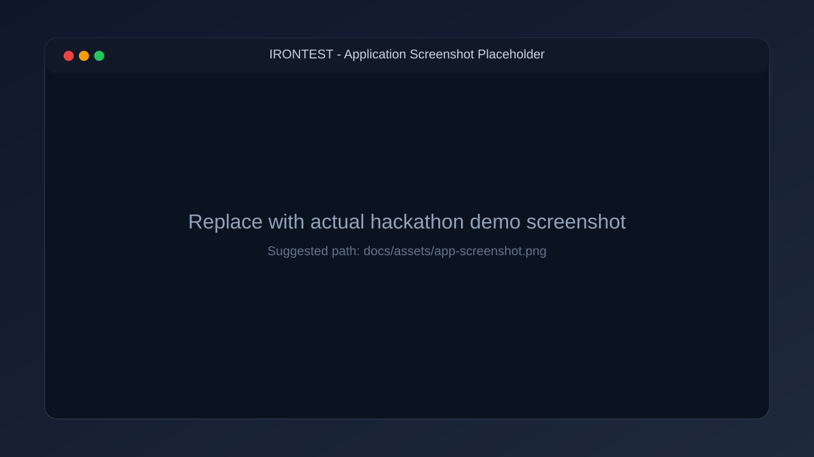
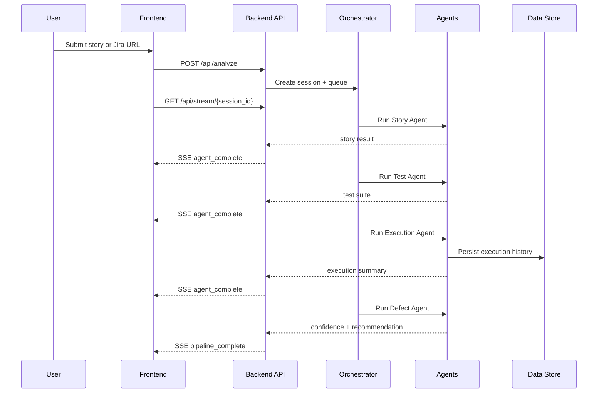

> Thank you Team ATOS for this challenging and fun hackathon experience.

# **IRONTEST**

Production-ready autonomous QA intelligence platform that converts Jira tickets and product stories into structured risk analysis, executable tests, and deployment confidence verdicts.

## Screenshot Placeholder



## Why IRONTEST

- Multi-agent QA pipeline with clear stage-by-stage telemetry.
- Fast feedback using streaming orchestration over SSE.
- Student-friendly cost profile via OpenRouter free-model defaults.
- Resilient history persistence (MongoDB primary with JSON fallback).

## Architecture

### System Topology

```mermaid
graph TD
	UI[React Frontend] -->|POST /api/analyze| API[FastAPI Backend]
	UI -->|POST /api/ingest/jira| API
	UI <-->|SSE /api/stream/{session_id}| API

	API --> ORCH[Pipeline Orchestrator]
	ORCH --> STORY[Story Agent]
	STORY --> TEST[Test Agent]
	TEST --> EXEC[Execution Agent]
	EXEC --> DEFECT[Defect Agent]

	STORY --> LLM[OpenRouter LLM]
	TEST --> LLM
	DEFECT --> LLM

	EXEC --> DB[(MongoDB)]
	DB -.fallback unavailable.-> JSON[(backend/data/history.json)]
	DEFECT --> DB
	DEFECT --> JSON
```

### Runtime Flow



## Documentation Map

- Setup guide: [setup.md](setup.md)
- Full docs folder: [docs](docs)
- Architecture deep dive: [docs/architecture.md](docs/architecture.md)
- Story agent: [docs/story_agent.md](docs/story_agent.md)
- Test agent: [docs/test_agent.md](docs/test_agent.md)
- Execution agent: [docs/execution_agent.md](docs/execution_agent.md)
- Defect agent: [docs/defect_agent.md](docs/defect_agent.md)
- Interface contract: [docs/interface.md](docs/interface.md)

## Quick Start

Follow [setup.md](setup.md) for complete setup.

Minimum requirements:

- Python 3.12+
- Node.js 20+
- OPENROUTER_API_KEY
- Optional MongoDB + Jira credentials for extended integrations

## Production Configuration

See [.env.example](.env.example) for the full environment matrix.

Core variables:

- OPENROUTER_API_KEY
- OPENROUTER_MODEL_ID (default: openai/gpt-oss-120b:free)
- OPENROUTER_MODEL_CANDIDATES (default fallback: openai/gpt-oss-20b:free)
- OPENROUTER_HTTP_REFERER
- OPENROUTER_APP_NAME
- MONGODB_URI
- MONGODB_DB_NAME
- MONGODB_COLLECTION
- JIRA_EMAIL
- JIRA_API_TOKEN

## API Surface

- POST /api/analyze
- GET /api/stream/{session_id}
- POST /api/ingest/jira
- POST /api/webhook/github
- GET /health

## Team

Team name: 838

| Member | Responsibility | Scope                                                                |
| ------ | -------------- | -------------------------------------------------------------------- |
| Ishan  | Agents         | Story, Test, Execution, Defect agent logic and orchestration quality |
| Aryan  | Frontend       | UX flow, dashboards, pipeline visualization, interaction polish      |
| Meet   | Backend        | API reliability, integrations, persistence, deployment wiring        |
