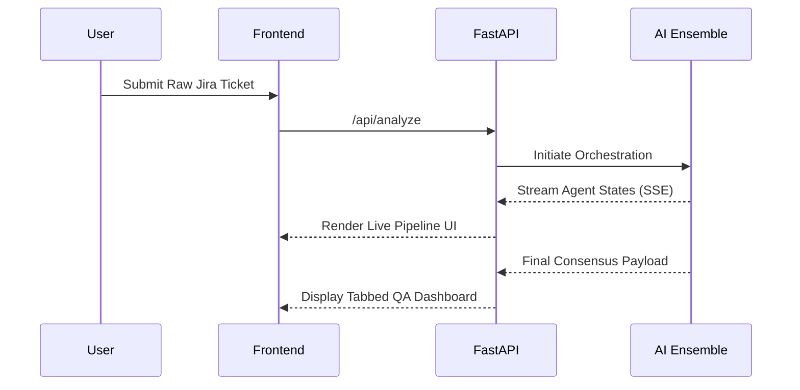

<div align="center">
  
  <h1>IronTest Autonomous QA</h1>
  <p><strong>Transform fragmented Jira stories into production-ready test suites in seconds.</strong></p>

  <p>
    **Thanks to Team ATOS for giving us this opportunity.**
  </p>

  <p>
    <a href="https://reactjs.org/"></a>
    <a href="https://fastapi.tiangolo.com/"></a>
    <a href="https://tailwindcss.com/"></a>
    <a href="https://groq.com/"></a>
  </p>
</div>

---

## 🚀 The Problem We Solved
QA is often the last major bottleneck before shipping to production. Writing comprehensive tests takes time, and edge cases are frequently missed. We built **IronTest** to automate the QA engineering lifecycle. Our goal was to take raw human intent—like a Jira ticket—and automatically generate test cases, edge case scenarios, and automation code snippets, ultimately giving a confidence score for deployment.

## 🧠 How It Works
We designed IronTest around three specialized agents that handle distinct parts of the testing process:

1. **[Story Agent](docs/story_agent.md)**: Parses the user story to extract actual requirements and acceptance criteria.
2. **[Test Agent](docs/test_agent.md)**: Takes those requirements and generates functional, boundary, and edge-case test vectors, along with code snippets.
3. **[Defect Agent](docs/defect_agent.md)**: Reviews the generated suite and calculates a Go/No-Go deployment confidence score.

> 📚 Check out the [docs/](./docs/) directory for an in-depth look at our architecture and agent design.

## 🎨 UI/UX 
Internal developer tools don't have to be ugly. We built the IronTest interface focusing on:
- Clean, minimalist layout using Tailwind CSS.
- Smooth transitions and real-time streaming updates via Framer Motion and Server-Sent Events.
- Full support for system-level Dark and Light modes.

## ⚡ Getting Started
### Prerequisites
- Python 3.12+ 
- Node.js 20+
- A valid `GROQ_API_KEY`

### 1. Backend Spin-up
```bash
cd backend
python -m venv .venv
source .venv/bin/activate  # Or .venv\Scripts\activate on Windows
pip install -r requirements.txt
export GROQ_API_KEY="your-api-key"
uvicorn main:app --reload
```

### 2. Frontend Spin-up
```bash
cd frontend
npm install
npm run dev
```

Navigate to `http://localhost:5173` to explore IronTest locally.

## 📊 Deployment Flow


## 🏆 Built for the Hackathon
We built IronTest to bridge the gap between product management intent and engineering reality, providing a tangible way to speed up the CI/CD pipeline while maintaining high quality. 
