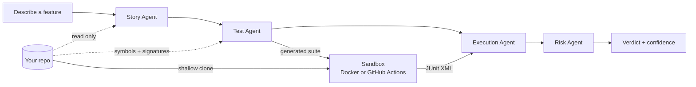

<h1 align="center">IRONTEST</h1>

<p align="center">
  Point it at a repository, describe what you're building, and get tests that
  actually run against your code.
</p>

<p align="center">
  <a href="#quick-start">Quick start</a> ·
  <a href="#how-it-works">How it works</a> ·
  <a href="docs/architecture.md">Architecture</a> ·
  <a href="docs/deployment.md">Deployment</a>
</p>

---

## What it does

Connect a GitHub repository and describe a feature in plain language, or import
a story from Jira or Azure DevOps. Four agents then read your actual source,
write tests that **import your real modules**, execute them in a sandbox, and
report what happened — with the runner's own output as evidence.

It works in two modes, which differ only in what a failure means:

| Mode | When | A failing test means |
| --- | --- | --- |
| **Already built** | The behavior ships today | You found a real defect |
| **Not built yet** | The feature doesn't exist | The red phase of TDD — the test *is* the spec |

That second mode is the answer to "what about a feature nobody has written
yet". The tests fail at import, and that is correct: they define what *done*
means, and you implement until they go green.

## How it works



1. **Story Agent** turns the requirement into intent, modules, acceptance
   criteria, and risks.
2. **Test Agent** reads your repository's stack, ranked source files, and the
   public symbols extracted from them, then writes tests that import those
   symbols by their real paths.
3. **Execution Agent** runs the suite in a sandbox — never on the API host —
   and parses the runner's JUnit report.
4. **Risk Agent** scores release confidence against this user's own run
   history and returns GO / CONDITIONAL GO / NO-GO.

## Beyond a single run

- **Analytics** — pass-rate and confidence trends, flaky-test detection (a test
  that flips pass/fail across runs of the same requirement), and the modules
  that fail most, all per user.
- **Fix suggestions** — a fifth agent proposes a concrete change for each
  failing test. Advisory; nothing is applied.
- **Regression gate** — run the same generated suite against a base branch and
  the working branch, and see exactly what newly fails.
- **Shareable reports** — any run gets a public read-only link (`/r/<token>`)
  plus Markdown / PDF export. Identity and repo name are stripped.
- **Open a PR** — turn a run's generated tests into a real pull request on the
  repository.
- **CI gate** — `deploy/irontest-pr-gate.yml` plus a personal API key runs
  IronTest on every pull request and posts the verdict as a PR comment.
- **Jira / Azure DevOps** — connect once on the Integrations page, then pick a
  requirement straight from your assigned issues.

## Honesty guarantees

These are enforced by tests, not convention:

- **A test that cannot fail is rejected.** Snippets that only assert literals
  against themselves are refused and reported as skipped, with the reason.
- **Results are never shaped.** A fully passing suite reports as fully passing.
  There is no sampling, no target band, no synthesized traceback.
- **No evidence is never reported as success.** A run that produced no
  parseable report fails loudly with its logs attached.
- **No sandbox means no run.** A repository run never silently degrades to
  local execution that could not have imported your code.
- **History never crosses users.** Every query is scoped by user id.

## Quick start

**Requirements:** Python 3.12+, Node 20+, and one free LLM API key.
Docker is optional but needed to run tests against a repository locally.

```bash
git clone <your-fork> && cd IronTest
cp .env.example .env
```

Fill in `.env`. At minimum you need one AI key and a GitHub OAuth app:

| Variable | Where to get it |
| --- | --- |
| `GROQ_API_KEY` | [console.groq.com/keys](https://console.groq.com/keys) — fastest, most generous free tier |
| `GEMINI_API_KEY` | [aistudio.google.com/apikey](https://aistudio.google.com/apikey) — largest free daily quota |
| `GITHUB_CLIENT_ID` / `SECRET` | [github.com/settings/developers](https://github.com/settings/developers) → New OAuth App |

Set the OAuth app's **Authorization callback URL** to
`http://localhost:8000/api/auth/github/callback`.

Adding more than one AI key is worth it: providers are tried in order, so a
rate limit on one silently falls through to the next instead of ending a run.

```bash
# Backend
cd backend
python -m venv .venv && .venv/Scripts/activate   # Windows
# source .venv/bin/activate                       # macOS / Linux
pip install -r requirements.txt
uvicorn main:app --reload

# Frontend, in a second terminal
cd frontend
npm install && npm run dev
```

Open http://localhost:5173.

Check your configuration any time at http://localhost:8000/health — it reports
which AI providers are live and which test sandbox was selected.

## Cost

Zero. Every AI provider is on its free tier, tests run either in local Docker
or on GitHub's free Actions runners, and both Render and Vercel host the
deployed app for free. See [docs/deployment.md](docs/deployment.md).

## Tests

```bash
cd backend && pytest -q      # 158 tests
cd frontend && npm run build
```

## Tech

React 18 · Vite · Tailwind · FastAPI · SQLAlchemy · SQLite/Postgres ·
Groq / Gemini / Cerebras / OpenRouter · Docker or GitHub Actions sandbox

## Documentation

- [Architecture](docs/architecture.md) — how the pieces fit and why
- [Deployment](docs/deployment.md) — free-tier hosting, end to end
- [Agents](docs/agents.md) — what each agent does
- [Security](docs/security.md) — trust boundaries and sandboxing

## Credits

Built for the ATOS hackathon by **Team 838** — Ishan, Aryan, and Meet.
