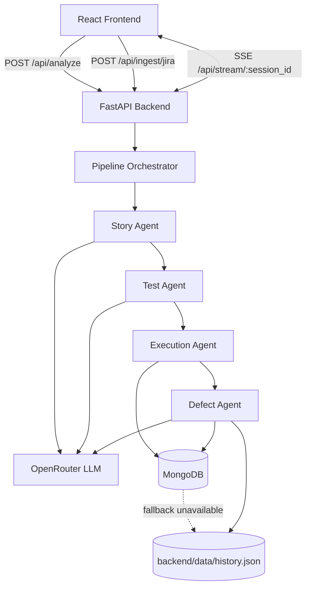
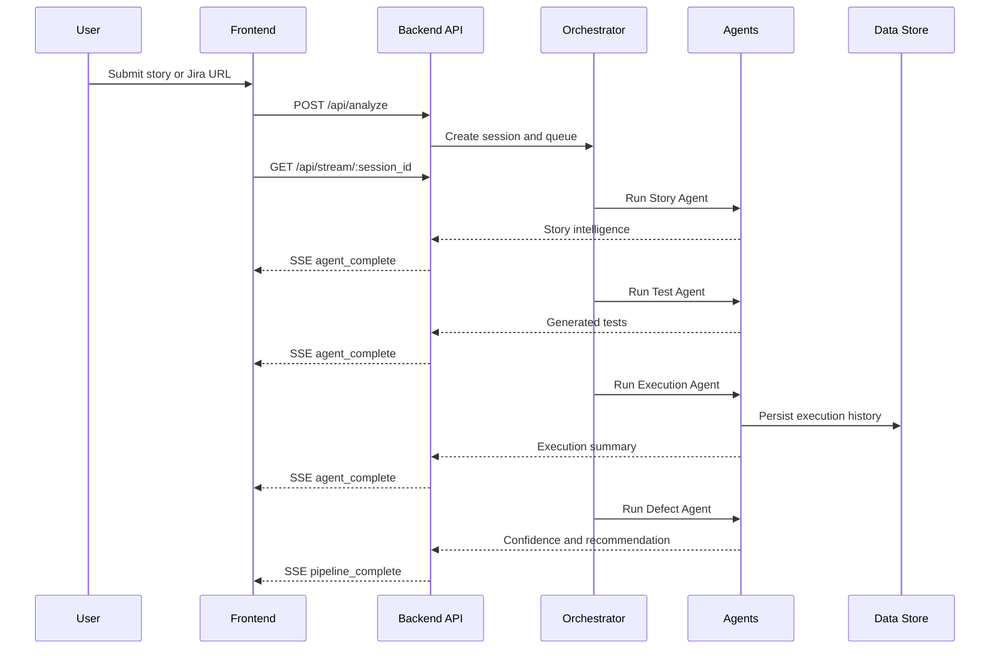

	

<h1 align="center"><strong>IRONTEST</strong></h1>

	Production-ready autonomous QA intelligence platform that transforms stories into test intelligence, execution evidence, and release confidence.

<strong>Thank you Team ATOS for this challenging and fun hackathon experience.</strong>

## Screenshot Placeholder

	

## Why IRONTEST

- Multi-agent QA pipeline with stage-by-stage telemetry.
- Streaming updates over Server-Sent Events for live traceability.
- Cost-aware OpenRouter default model profile for hackathon usage.
- Resilient storage strategy with MongoDB primary and JSON fallback.

## Tech Stack

<table align="center">
	<tr>
		<td align="center"><strong>Frontend</strong> React Vite Tailwind CSS Framer Motion</td>
		<td align="center"><strong>Backend</strong> FastAPI Pydantic Requests Pytest</td>
		<td align="center"><strong>AI Gateway</strong> OpenRouter openai/gpt-oss-120b:free Fallback candidates supported</td>
	</tr>
	<tr>
		<td align="center"><strong>Data</strong> MongoDB primary history.json fallback</td>
		<td align="center"><strong>Integrations</strong> Jira REST API v3</td>
		<td align="center"><strong>Runtime Pattern</strong> SSE streaming orchestration Agent-by-agent telemetry</td>
	</tr>
</table>

## Architecture

### System Topology

### Runtime Flow

## Documentation Map

- Setup guide: [setup.md](setup.md)
- Full documentation: [docs](docs)
- Architecture deep dive: [docs/architecture.md](docs/architecture.md)
- Story agent: [docs/story_agent.md](docs/story_agent.md)
- Test agent: [docs/test_agent.md](docs/test_agent.md)
- Execution agent: [docs/execution_agent.md](docs/execution_agent.md)
- Defect agent: [docs/defect_agent.md](docs/defect_agent.md)
- Interface contract: [docs/interface.md](docs/interface.md)

## Quick Start

Follow [setup.md](setup.md) for complete local setup.

Minimum requirements:

- Python 3.12+
- Node.js 20+
- OPENROUTER_API_KEY
- Optional MongoDB and Jira credentials

## Production Configuration

See [.env.example](.env.example) for all supported variables.

Core variables:

- OPENROUTER_API_KEY
- OPENROUTER_MODEL_ID (default: openai/gpt-oss-120b:free)
- OPENROUTER_MODEL_CANDIDATES (fallback: openai/gpt-oss-20b:free)
- OPENROUTER_HTTP_REFERER
- OPENROUTER_APP_NAME
- MONGODB_URI
- MONGODB_DB_NAME
- MONGODB_COLLECTION
- JIRA_EMAIL
- JIRA_API_TOKEN

## API Surface

- POST /api/analyze
- GET /api/stream/{session_id}
- POST /api/ingest/jira
- POST /api/webhook/github
- GET /health

## Team 838

| Member | Responsibility | Scope                                                                |
| ------ | -------------- | -------------------------------------------------------------------- |
| Ishan  | Agents         | Story, Test, Execution, Defect agent logic and orchestration quality |
| Aryan  | Frontend       | UX flow, dashboards, pipeline visualization, interaction polish      |
| Meet   | Backend        | API reliability, integrations, persistence, deployment wiring        |
