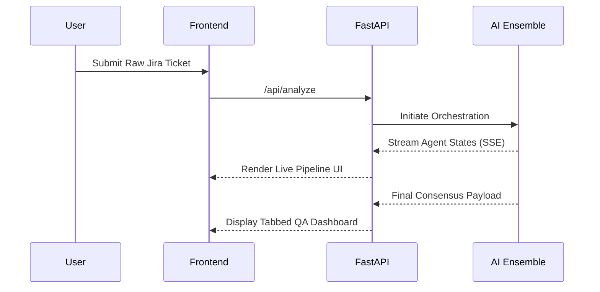

<div align="center">
  
  <h1>IronTest Autonomous QA Engine</h1>
  <p><strong>Transform fragmented Jira stories into production-ready test suites in 4.5 seconds.</strong></p>

  <p>
    <a href="https://reactjs.org/"></a>
    <a href="https://fastapi.tiangolo.com/"></a>
    <a href="https://tailwindcss.com/"></a>
    <a href="https://groq.com/"></a>
  </p>
</div>

---

## 🚀 The Vision
QA is the last major bottleneck in modern software delivery. **IronTest** is a multi-agent artificial intelligence orchestrator designed to completely automate the QA engineering lifecycle. By deploying specialized, autonomous agents, it parses raw human intent, synthesizes edge-case test vectors, generates automation codes, and calculates mathematical deployment confidence—all wrapped in an Awwwards-winning, Apple-inspired interface.

## 🧠 The Multi-Agent Architecture
IronTest is powered by three specialized AI nodes working in sequential harmony:

1. **[Story Agent (Intent Architect)](docs/story_agent.md)**: Converts chaotic user stories into structured topological matrices.
2. **[Test Agent (Vector Synthesizer)](docs/test_agent.md)**: Maps intent to exhaustive functional, boundary, and edge test vectors, complete with automation snippets.
3. **[Defect Agent (Verdict Engine)](docs/defect_agent.md)**: Audits the generated suite to calculate a rigorous Go/No-Go deployment confidence score.

> 📚 **Deep Dive**: Check out the [docs/](./docs/) directory for detailed intelligence profiles and system architecture.

## 🎨 UI/UX Philosophy
We believe highly technical tools shouldn't look like spreadsheets. IronTest features:
- **Awwwards-Style Constraints**: Sub-pixel perfect minimalist typography and dynamic grid layouts.
- **Framer Motion Integration**: Liquid smooth transitions and zero-layout-shift streams.
- **Theme Native**: Flawless system-level Dark and Light mode toggling.

## ⚡ Getting Started
### Prerequisites
- Python 3.12+ 
- Node.js 20+
- A valid `GROQ_API_KEY`

### 1. Backend Spin-up
```bash
cd backend
python -m venv .venv
source .venv/bin/activate  # Or .venv\Scripts\activate on Windows
pip install -r requirements.txt
export GROQ_API_KEY="your-api-key"
uvicorn main:app --reload
```

### 2. Frontend Spin-up
```bash
cd frontend
npm install
npm run dev
```

Navigate to `http://localhost:5173` to experience IronTest.

## 📊 Deployment Flow


## 🏆 Hackathon Ready
Built aggressively for modern engineering teams. IronTest bridges the gap between PM intent, engineering reality, and CI/CD automation.

<div align="center">
  <p><i>Design engineered for intelligence.</i></p>
</div>
