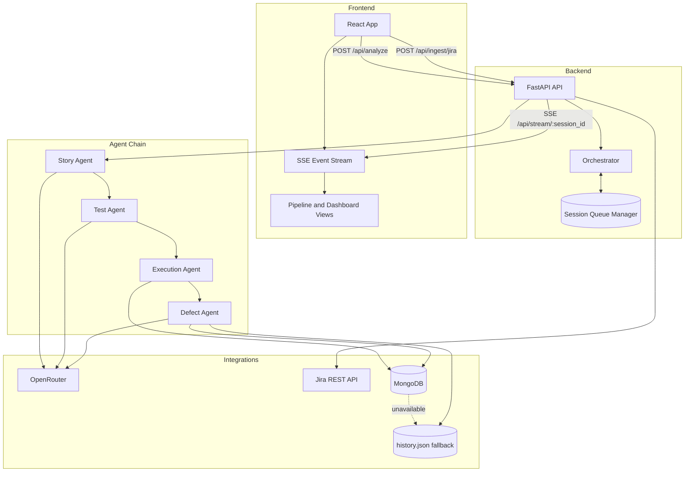
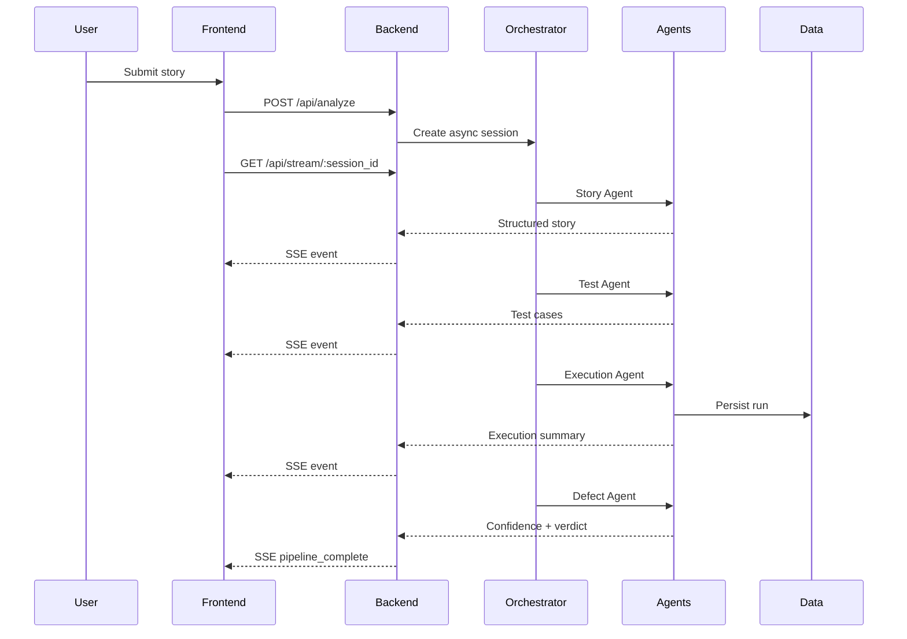

# IRONTEST Architecture

## Overview

IRONTEST is a React + FastAPI autonomous QA platform that transforms product requirements into executable QA intelligence in four deterministic stages.

1. Story analysis
2. Test generation
3. Test execution
4. Defect intelligence and deployment verdict

## Runtime Topology

## Request Lifecycle

## Integration Notes

- LLM provider: OpenRouter via backend/llm_client.py.
- Default model profile: openai/gpt-oss-120b:free with free-tier fallback candidates.
- Jira ingestion: Jira REST API v3 via backend/jira_client.py.
- Persistence: MongoDB with backend/data/history.json fallback for resilience.

## Operational Notes

- The application remains fully functional if MongoDB is unreachable.
- SSE delivery allows progressive UX updates while the pipeline is running.
- Agent outputs are normalized and validated before being rendered in UI.

## Related Docs

- Project setup: [../setup.md](../setup.md)
- Interface contract: [./interface.md](./interface.md)
- Story agent: [./story_agent.md](./story_agent.md)
- Test agent: [./test_agent.md](./test_agent.md)
- Execution agent: [./execution_agent.md](./execution_agent.md)
- Defect agent: [./defect_agent.md](./defect_agent.md)
