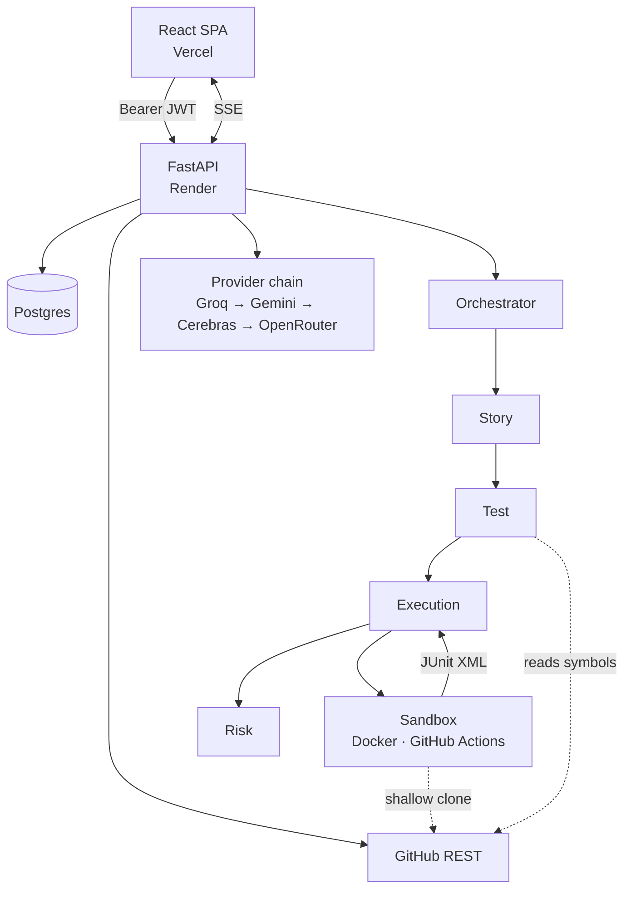

# Architecture

## Topology



## The decisions that matter

### Tests execute in a sandbox, never in-process

Generated tests import the target repository's modules, which means running
arbitrary third-party code plus whatever its dependency install scripts do.
`runners/` puts that behind one interface with two backends: Docker locally,
GitHub Actions when deployed.

Selection never falls back to local execution for a repository run. The local
backend cannot import repository code, so a result from it would be
meaningless. No sandbox means the run fails with an explanation.

### Results come only from the runner's own report

Outcomes are parsed from JUnit XML. Nothing is inferred from an exit code, and
nothing is synthesized when output is missing — a run that produced no
parseable report is a failure with logs attached, not a pass.

This is a direct response to how the previous build worked, which forced
outcomes into a 7-or-8-of-10 band and attached fabricated tracebacks. See
[the honesty tests](../backend/tests/test_execution_honesty.py).

### Agents hold no database session

The orchestrator resolves learning context and module history and injects them.
An agent therefore cannot read another user's runs by construction, rather than
by remembering to filter. It also keeps agents unit-testable without a
database.

### The provider chain assumes rate limits are normal

Free tiers rate-limit constantly, so exhausting a provider is routine rather
than exceptional. `llm/client.py` walks providers in order and each provider's
models in order, retrying transient statuses and honouring `Retry-After`, then
escalating prompt-repair re-asks before abandoning a model. All four providers
speak the OpenAI-compatible `/chat/completions` shape — Gemini via its
compatibility layer — so one client covers them.

### Story identity groups runs for trends

A run is keyed by a hash of its requirement text, so repeated runs of the same
story form a series. That is what makes "pass rate is declining for this
module" a real measurement rather than a comparison across unrelated work.

## Layout

```
backend/
  main.py              app wiring, CORS, SSE
  config.py            settings; normalises Render's postgres:// URL
  auth.py              current_user / github_token dependencies
  security.py          JWT sessions, Fernet token encryption
  github_client.py     OAuth exchange, repos, trees, file contents
  repo_analysis.py     stack detection, symbol extraction, file ranking
  history.py           run history and learning signals, all user-scoped
  db/                  SQLAlchemy models and session management
  llm/                 provider registry, failover client, JSON recovery
  agents/              story, test, repo_test, execution, defect, orchestrator
  runners/             sandbox interface, Docker, GitHub Actions, JUnit parsing
  routers/             auth, repositories, chats
  tests/               101 tests

frontend/src/
  lib/                 API client, auth context
  components/          design-system primitives, shell, pipeline, results
  pages/               landing, callback, dashboard, chat, runs
```

## Request flow for a run

1. `POST /api/chats/{id}/runs` authenticates, resolves the repository, decrypts
   the user's GitHub token, and returns an SSE session id.
2. The orchestrator creates a `pipeline_runs` row with status `running`.
3. Story analysis, then repository context (stack + ranked files + symbols),
   then generation, then sandboxed execution, then risk scoring — each emitting
   an SSE event.
4. The row is completed with real counts; pass rate excludes skipped cases,
   since they never ran.
5. On failure the row is marked `failed` with the message, and the client is
   told. Nothing partial is presented as a result.

## Data model

`users` → `repositories` → `chats` → `messages`, with `pipeline_runs` joined to
user, repository, and chat. Every user-owned table carries `user_id` and every
history query filters on it.

Schema is created with `create_all` on startup, which is sufficient while the
schema only grows. A destructive change needs a real migration tool.
