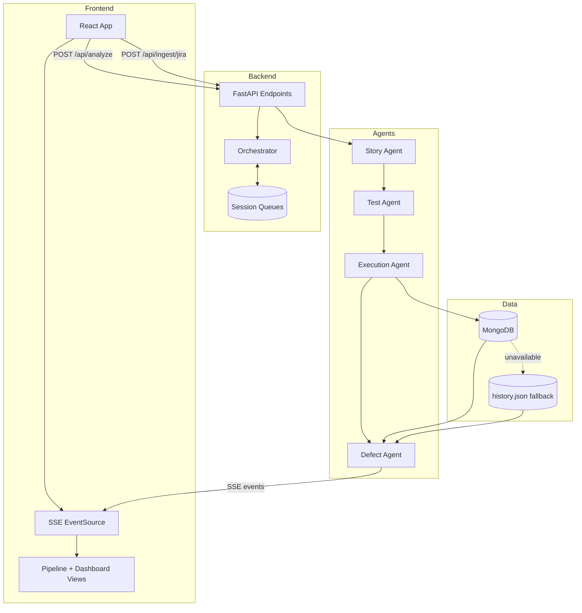

# IronTest System Architecture

## Overview

IronTest is a React + FastAPI system that orchestrates four specialized QA agents. It ingests user stories or Jira issues, generates executable tests, runs them in isolation, and computes a deployability score from both current execution and historical trends.

## Runtime Topology

## Request Flow

1. Frontend submits user story text to POST /api/analyze or imports issue details via POST /api/ingest/jira.
2. Orchestrator creates a session queue and runs agents in sequence.
3. Each agent start/completion is streamed to the client through GET /api/stream/{session_id}.
4. Execution results are persisted in MongoDB (or fallback JSON file).
5. Defect Agent computes module risks and final confidence score using:
   - LLM risk reasoning
   - current pass/fail/error mix
   - historical average and recent trend
6. Frontend renders pipeline telemetry and final deployment verdict.

## Integration Notes

- LLM Provider: Gemini via backend/llm_client.py.
- Jira Ingestion: Jira REST API v3 via backend/jira_client.py.
- Persistence: pymongo with fallback mode for local demo resilience.

## Current Local Run Mode

At the moment, the local environment is configured with GEMINI_API_KEY only.

- MongoDB variables are pending user-side setup.
- Jira env credentials are pending user-side setup.
- System remains operational by using JSON history fallback and optional Jira credentials passed in UI/request.

## Tech Stack

- Frontend: React, Vite, Tailwind CSS, Framer Motion.
- Backend: FastAPI, Pydantic, requests, pymongo, pytest.
- AI: Gemini (default model gemini-2.5-flash with failover candidates).
