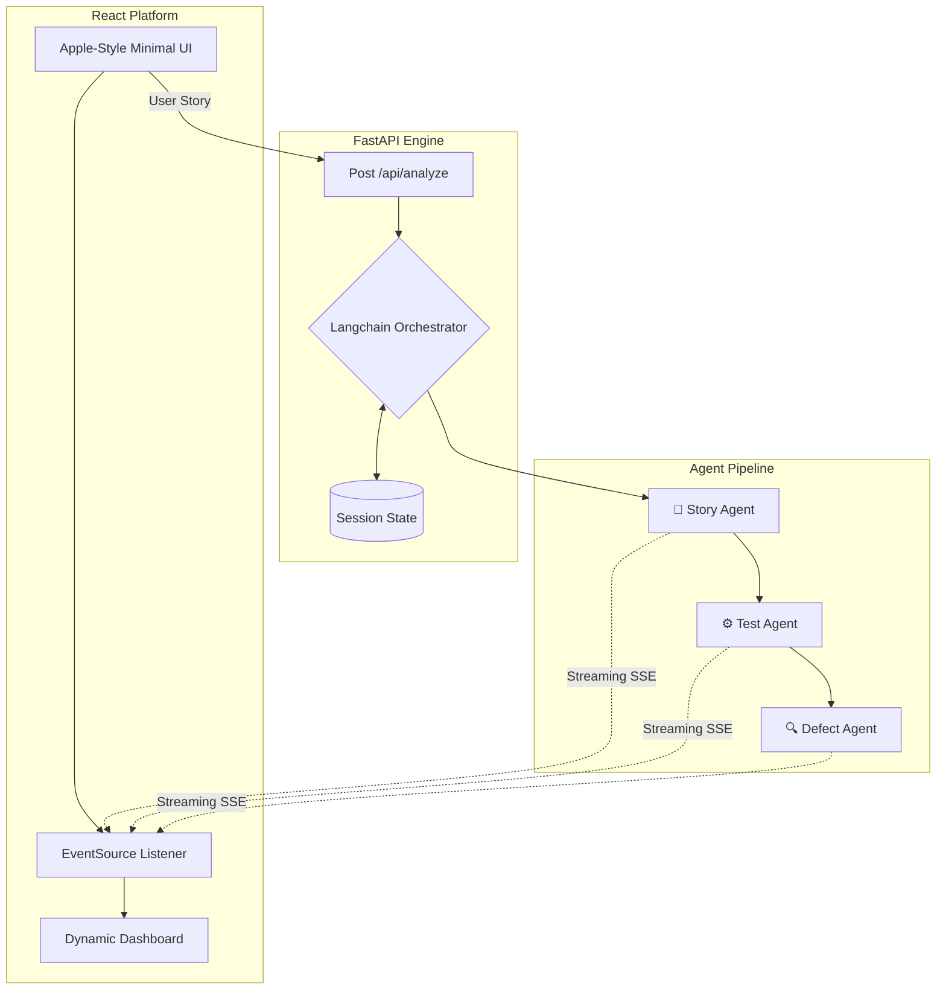

# IronTest System Architecture

## Overview
We built IronTest to tackle the manual QA bottleneck by converting raw user stories into actionable test suites and identifying potential risk areas. We went with a React frontend and a FastAPI backend to easily handle real-time streaming from our LLM agents.

## Architecture Topology

## How the Pieces Fit Together
1. **The Entry Point**: The user submits a story or ticket via the React frontend. This payload hits our FastAPI backend.
2. **The Orchestrator**: The backend spins up an async session to manage the agent pipeline. We use Server-Sent Events (SSE) to stream logs back to the frontend in real-time so the user isn't stuck waiting.
3. **Agent Pipeline**:
   - The **Story Agent** parses the raw text and outputs structured JSON containing the core requirements.
   - The **Test Agent** takes those requirements and generates specific test cases.
   - The **Defect Agent** reviews the entire output to provide a final deployment recommendation.
4. **Data Visualization**: Once the pipeline completes, the final structured payload is sent to the frontend, which renders an interactive dashboard of the results.

## Technology Stack
- **Frontend**: React, Tailwind CSS, Framer Motion, Vite.
- **Backend**: Python 3.12, FastAPI, Pydantic, HTTPX.
- **AI Integration**: Groq API (Llama 3) with structured JSON extraction to ensure consistent agent outputs.
