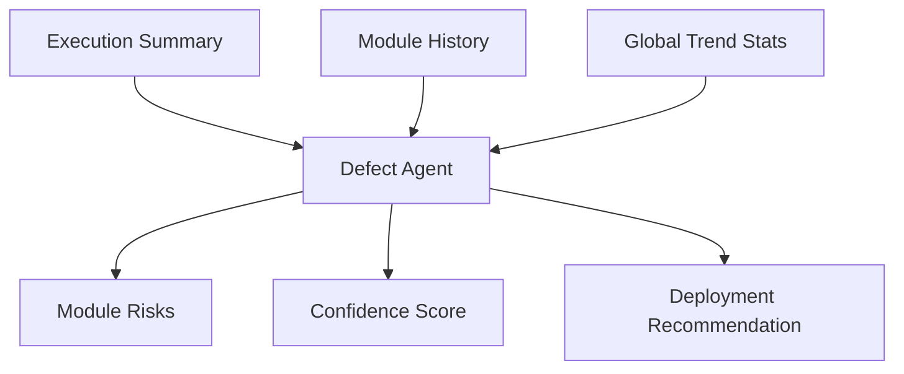

# Defect Agent

## Overview

The Defect Agent is the final risk layer. It combines current execution outcomes with historical data to produce module-level risk and a deployability verdict.

## Implemented Responsibilities

1. Pull module and global history stats from database.py.
2. Evaluate execution outcomes from TestExecutionSummary.
3. Ask Gemini for risk interpretation and critical test prioritization.
4. Compute blended confidence score and final recommendation.

## Data Inputs

- Story modules
- Generated tests (without full snippet payload)
- Execution summary (pass/fail/error)
- Historical module stats (defect probability, runs, pass rate)
- Historical global stats (average and recent pass rate)

## Confidence Logic

The final score blends:

- LLM confidence proposal
- current pass-rate
- historical average pass-rate
- recent trend delta
- explicit fail/error penalties

Recommendation is then mapped to GO, CONDITIONAL GO, or NO-GO with conservative behavior when execution errors are present.

## Persistence Dependency

- Primary source: MongoDB collection configured by MONGODB_URI, MONGODB_DB_NAME, MONGODB_COLLECTION.
- Fallback source: backend/data/history.json when MongoDB is not reachable.
- Current local setup note: MongoDB env setup is pending, so fallback JSON history is expected during local runs.

## Flow

