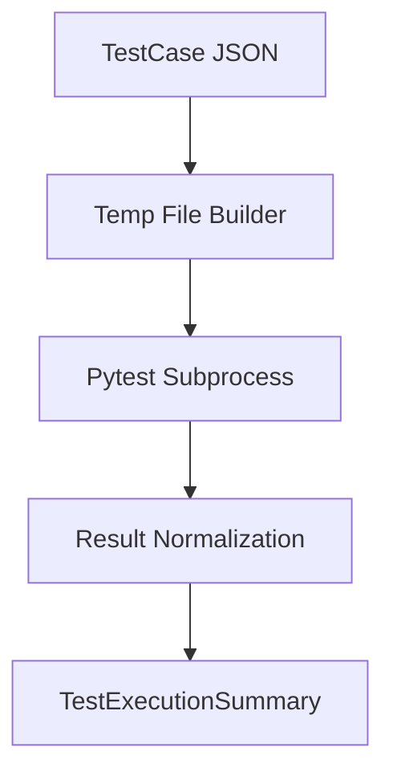

# Execution Agent

## Overview

The Execution Agent runs generated automation snippets and produces normalized pass/fail/error outputs with evidence logs.

## Implemented Responsibilities

1. Isolate each run in a TemporaryDirectory.
2. Build runnable pytest files from generated snippet lines.
3. Prevent external side effects by stubbing requests and common hallucinated service handles.
4. Return structured TestExecutionSummary for downstream risk analysis.

## Runtime Behavior

- If snippet has no function definition, it auto-wraps the code in a test function.
- Executes tests via subprocess: python -m pytest <temp_file> -v --tb=short.
- Enforces per-test timeout (20s).
- Captures and truncates long logs before returning results.
- Works independently of MongoDB and Jira env configuration.

## Output

Each test receives one of:

- pass
- fail
- error
- skipped

Returned as TestExecutionSummary:

- results[] (test_id, status, error_message)
- duration_seconds

## Flow

