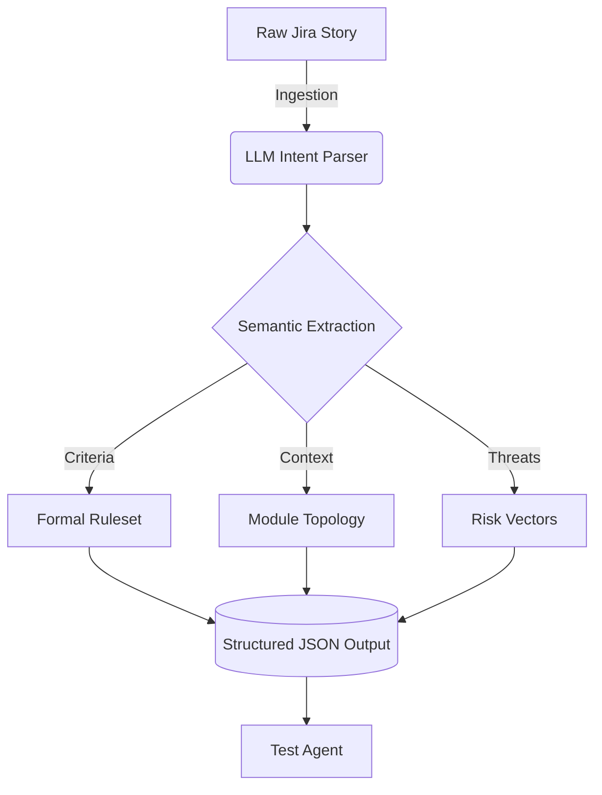

# Story Agent (🧠 Intent Architect)

## Overview
The **Story Agent** is the genesis of the IronTest autonomous pipeline. It acts as the "Intent Architect," parsing raw, unstructured human language (often messy Jira tickets, PR descriptions, or rough Slack messages) and transforming it into a strict, mathematically rigid **Intent Matrix**. 

## Core Responsibilities
1. **Semantic Parsing**: Uses LLM-driven Natural Language Understanding (NLU) to digest the user story and extract the true business intent.
2. **Acceptance Criteria Extraction**: Identifies and formalizes the underlying acceptance criteria, separating hard requirements from "nice-to-haves."
3. **Microservice Mapping**: Automatically infers which system modules, databases, or third-party APIs will be impacted by the intent.
4. **Risk Topography**: Flags immediate structural risks (e.g., "This requires a 3rd party API, latency might be an issue").

## Technical Flow

## Prompt Engineering specifics
The agent is prompted utilizing a systemic constraint methodology. It is forced to output strictly valid JSON, enforcing keys for `modules`, `core_intent`, `acceptance_criteria`, and `risk_factors`. This guarantees that downstream agents receive untainted, machine-processable data.
