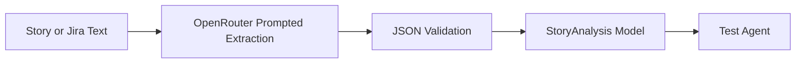

# Story Agent

## Overview

The Story Agent converts free-form requirement text into a normalized structure used by all downstream agents. Input can come from manual text entry or from the Jira ingestion endpoint output.

## Implemented Responsibilities

1. Parse business intent from ambiguous story text.
2. Extract acceptance criteria and likely impacted modules.
3. Identify risk and security vectors early.
4. Suggest probable microservices impacted by the change.

## Input and Output

Input:

- Raw user story text from POST /api/analyze.
- Or formatted Jira issue text returned by POST /api/ingest/jira.

Output schema:

- intent
- modules[]
- acceptance_criteria[]
- risk_factors[]
- security_vectors[]
- microservices[]

## Technical Notes

- Uses OpenRouter through backend/llm_client.py.
- Requests JSON-only output and validates schema shape before model parsing.
- Parsed into the StoryAnalysis Pydantic model for strict downstream consistency.
- Requires OPENROUTER_API_KEY for model execution.

## Flow

