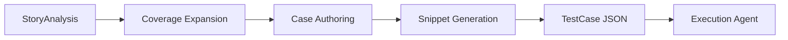

# Test Agent

## Overview

The Test Agent transforms StoryAnalysis output into executable test vectors and automation snippets. It is optimized to produce broad coverage while staying machine-readable for execution.

## Implemented Responsibilities

1. Generate functional, boundary, edge_case, and regression tests.
2. Attach risk levels per test case.
3. Emit explicit execution steps and expected outcomes.
4. Generate python snippet lines suitable for pytest execution.

## Output Contract

The agent returns a JSON object with test_cases[] where each item includes:

- id
- type (functional | boundary | edge_case | regression)
- module
- description
- steps[]
- expected_result
- risk_level (low | medium | high)
- automated
- automation_snippet[]

## Technical Notes

- Uses Gemini through backend/llm_client.py.
- Prompt enforces JSON-only output.
- Output is validated with the TestCase Pydantic model.
- Snippets are later executed by the Execution Agent in an isolated temp environment.
- Current local environment uses GEMINI_API_KEY only; this agent is fully functional in that mode.

## Flow

